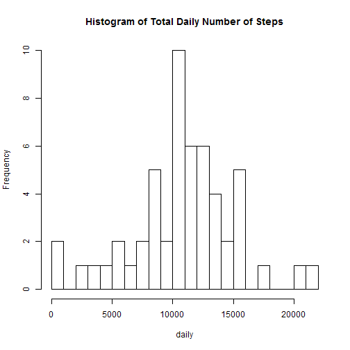
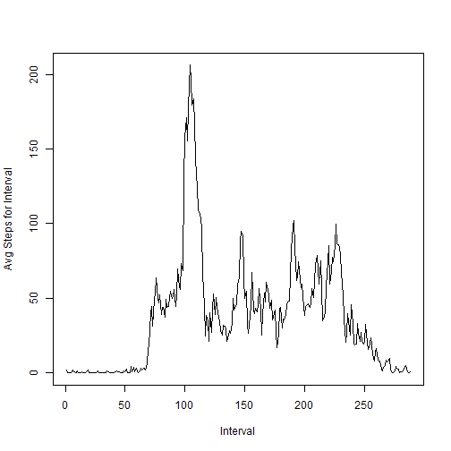
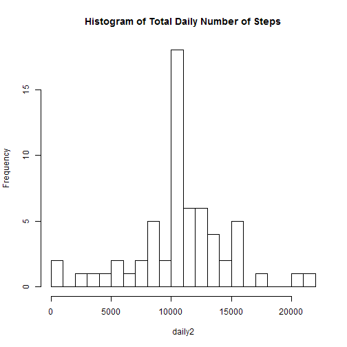
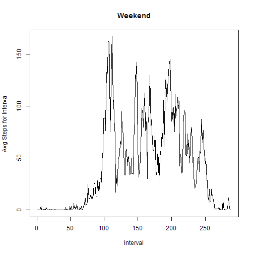
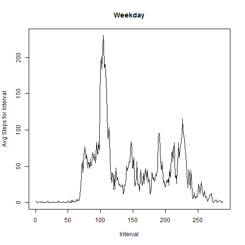

# Reproducible Research: Peer Assessment 1
Stephen Goldberger  
8/12/14

## Loading and preprocessing the data

```r
ACT <- read.csv(unz("activity.zip", "activity.csv"), header=T)
ACT$date <- as.Date(ACT$date)
```

## What is mean total number of steps taken per day?
First I produced a histogram of the total number of steps each day, while ignoring NA values.    

```r
t <- complete.cases(ACT$steps, ACT$date, ACT$interval)
daily <- tapply(ACT[t,1],ACT[t,2],sum)
hist(daily, breaks = 20, main = "Histogram of Total Daily Number of Steps")
```

 

Then I calculated the mean and median total number of steps completed each day.

```r
mean(daily)
```

```
## [1] 10766
```

```r
median(daily)
```

```
## [1] 10765
```

## What is the average daily activity pattern?

```r
intervalavg <- tapply(ACT[t,1],ACT[t,3],mean)
plot(intervalavg,type = "l", 
        ylab = "Avg Steps for Interval" ,xlab = "Interval")
```

 

The interval with the most number of steps is:

```r
intervalavg[which.max(intervalavg)]
```

```
##   835 
## 206.2
```

## Imputing missing values
Find the number of rows with missing data:

```r
sum(!t)
```

```
## [1] 2304
```
I am going to use the mean for the 5 minute interval to replace the NA observations and call it ACT2.

```r
ACT2 <- ACT
for (i in 1:nrow(ACT2)) {
        if (is.na(ACT2[i,1])) {
                ACT2[i,1] <- intervalavg[names(intervalavg) == 
                                                as.character(ACT2[i,3])]               
        }
}
```

Here is the histogram and mean/median for the new data.

```r
daily2 <- tapply(ACT2[,1],ACT2[,2],sum)
hist(daily2, breaks = 20, main = "Histogram of Total Daily Number of Steps")
```

 

```r
mean(daily2)
```

```
## [1] 10766
```

```r
median(daily2)
```

```
## [1] 10766
```

The only difference appears to be there are a lot more at the mean value of the histogram.  The mean and medians are roughly identical.  If we look at the length of the vectors:

```r
length(daily)
```

```
## [1] 53
```

```r
length(daily2)
```

```
## [1] 61
```
So the NA values appear to be entire days, and we are adding more complete days with average values.


## Are there differences in activity patterns between weekdays and weekends?


```r
ACT2$dayname <- weekdays(ACT2$date)
ACT2end <- subset(ACT2, dayname == "Saturday" | dayname == "Sunday")
ACT2notend <- subset(ACT2, !(dayname == "Saturday" | dayname == "Sunday"))

intervalavgWE <- tapply(ACT2end[,1],ACT2end[,3],mean)
plot(intervalavgWE,type = "l", 
        ylab = "Avg Steps for Interval" ,xlab = "Interval", main = "Weekend")
```

 

```r
intervalavgWD <- tapply(ACT2notend[,1],ACT2notend[,3],mean)
plot(intervalavgWD,type = "l", 
        ylab = "Avg Steps for Interval" ,xlab = "Interval", main = "Weekday")
```

 
